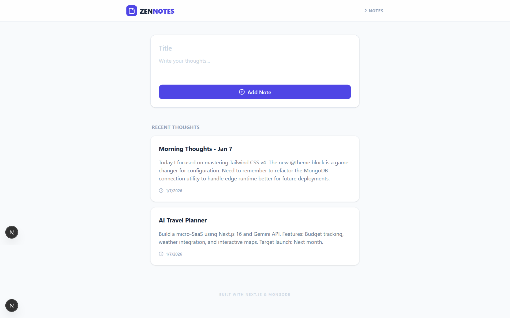

# ZENOTES - Full-Stack Note Management System

A professional note-taking application designed with a focus on performance, type safety, and modern user interface principles. This application leverages Next.js Server Actions for efficient data handling and MongoDB for persistent storage.



## Project Overview

This project serves as a comprehensive example of a CRUD application using the Next.js App Router architecture. It features inline editing, server-side data fetching, and a utility-first styling approach.

## Technical Specification

* **Framework:** Next.js 16 (App Router)
* **Language:** TypeScript
* **Database:** MongoDB via Mongoose ODM
* **Styling:** Tailwind CSS v4
* **Icons:** Lucide React

## Functional Requirements

The application fulfills the following requirements:
1. **Create:** Users can submit new notes via a validated form.
2. **Read:** Notes are fetched on the server and rendered with high SEO efficiency.
3. **Update:** Inline editing allows modification of existing titles and content.
4. **Delete:** Instant removal of entries with cache revalidation.

## Directory Structure

    app/        - Contains core application logic, layouts, and server actions.
    components/ - Contains modular React components for the UI.
    lib/        - Database connection configuration and utilities.
    models/     - Data schemas and TypeScript interface definitions.
    types/      - Global type declarations.

## Installation and Setup

### 1. Clone the Repository
Open a terminal and execute the following commands:

```bash
git clone https://github.com/sandeep-kumar-21/my-note-app.git
cd my-note-app
```

### 2. Install Dependencies
Install the required packages using the Node Package Manager:

```bash
npm install
```

### 3. Environment Configuration
Create a file named `.env.local` in the root directory. This file must contain your MongoDB connection string to function correctly:

```text
MONGODB_URI=your_mongodb_connection_string
```

### 4. Development Mode
Start the local development server:

```bash
npm run dev
```

The application will be accessible at http://localhost:3000.

## Database Schema

The Note model consists of the following fields:
* `title`: String (Required)
* `content`: String (Required)
* `createdAt`: Date (Automatically generated)
* `updatedAt`: Date (Automatically generated)

## Deployment

This application is optimized for deployment on the Vercel platform. Ensure that the `MONGODB_URI` environment variable is configured in your project settings prior to deployment.